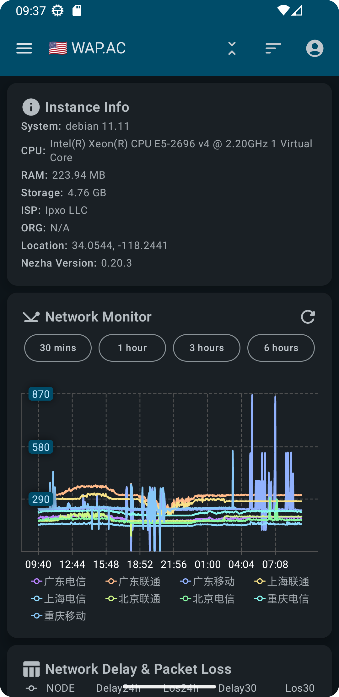
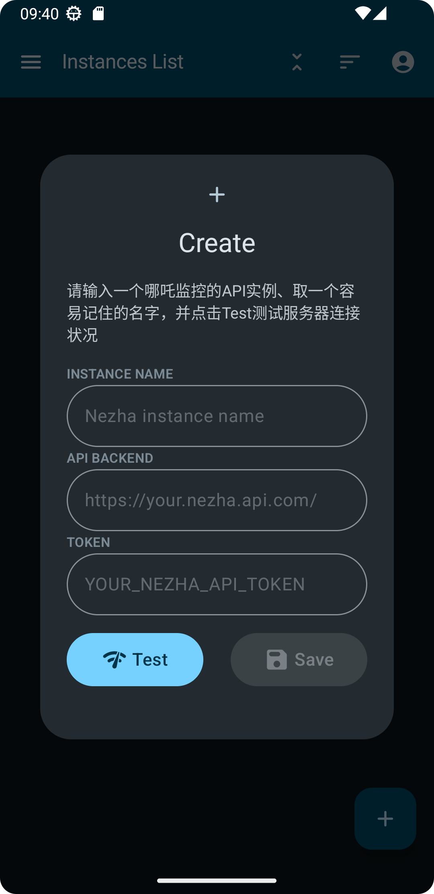
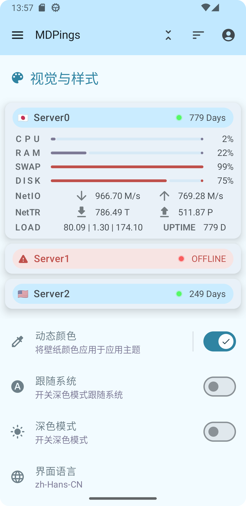

## MDPings

MDPings 是一个基于哪吒监控 API 接口开发的 MD3 风格 Android 客户端，支持同时监控多个服务器的状态，提供历史网络状态和延迟图表

## 界面

### 主页

     

### 详情页

     

### 其他

     

## Features

✈️ 多后端切换

💡 MD3风格

## Download

## 常见问题

#### 1.支持的哪吒监控版本？

目前确认支持的有最新版的 `0.20.13（面板端）` ，其余版本未有条件测试。且已经确认出现过因为版本过老，API返回的json信息缺项而导致的应用闪退问题，因此如果出现类似 Test 后应用直接闪退的问题，**请先更新哪吒监控到最新版本**，本项目目前仅有精力维护和支持最新版本哪吒监控。

#### 2.我的应用闪退了

请参照第一点，先更新哪吒监控的版本。

#### 3.点击 Test 后弹出 TOAST 显示 `Something went wrong, please try again later`.

已修复，感谢 tg@呆呆 提供的debug用实例。

#### 4.API BACKEND一项的格式？

如空白截图显示，`https://your.nezha.api.com/` 

> [!IMPORTANT]
> 请不要漏掉链接里最后的斜杠，否则 Test 将无法通过。

## TODO

> [!CAUTION]
> 由于预计哪吒监控1.0的API将会有大幅度变动，因此在1.0版更新出来前，将不会有大的改动

- [ ] 横屏/平板适配

- [x] 日间/夜间/主题色切换

- [x] 统一界面语言、多语言支持

## 支持

1.点击页面顶部的星标（⭐）

2.Push我OVH传家宝 KS-LE-B 2*1.92t 中奖鸡（？）

3.提出UI界面设计、交互操控的改进意见（最好能带示意图）

4.指点一下我的kotlin屎山

等等等等……都是我继续改进MDPings的动力，谢谢你。