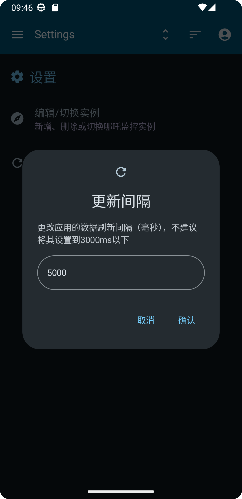

## MDPings

MDPings 是一个基于哪吒监控 API 接口开发的 MD3 风格 Android 客户端，支持同时监控多个服务器的状态，提供历史网络状态和延迟图表

## 界面

### 主页

     

### 详情页

     

### 其他

     

## Features

✈️ 多后端切换

💡 MD3风格

## Download

## TODO

- [ ] P.S.由于预计哪吒监控1.0的API将会有大幅度变动，因此在1.0版更新出来前，期间不会有大的改动
- [ ] 横屏/平板适配

## Star

支持开发者的最简单方式是点击页面顶部的星标（⭐），或者来指点一下屎山（？）