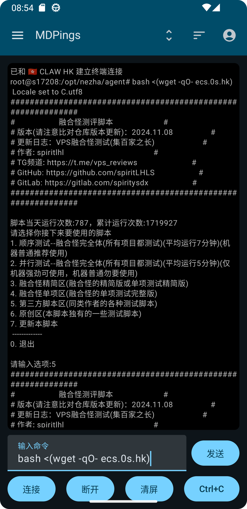

## MDPings

MDPings 是一个基于哪吒监控 API 接口开发的 MD3 风格 Android 客户端，支持同时监控多个服务器的状态，提供历史网络状态和延迟图表，
并可连接设备终端执行简单的、弱交互式的命令。

## 界面

### 主页（平板）

    

### 主页（手机）

     

### 其他（手机）

     

     

## Features

✈️ 多后端切换

🖥️ 总流量监控、ssh终端（需要 nezha dashboard 允许 ssh 连接）

💡 MD3风格、自适应布局

## Download

## 常见问题

#### 1.支持的哪吒监控版本？

`MDPings 1.0.4(L)` 版本对应支持 哪吒监控v0 `0.20.13+` 版本，版本号带`L`的版本修改了包名，可以跟v1共存。

`MDPings 1.1.4` 版本对应支持 哪吒监控v1 `1.0.20 - 1.1.4` （更高版本未经测试，或许可用）。

因为目前还有挺多人在 `v0版本` 观望，因此 `v0版本` 将不会立刻舍弃，部分能力范围内能同步过去的ui/功能更新会在有心情的时候做，主要还是以适配 v1 的新接口为主。

#### 2.应用闪退了

请参照第一点，可以尝试更新哪吒监控的版本到 MDPings 对应支持的版本。

#### 3.【v0】点击 Test 后弹出 TOAST 显示 `未知错误/Something went wrong, please try again later`.

已在 `MDPings 1.0.4` 版本解决 ，感谢 `TG@呆呆` 提供的 debug 用实例。

如果你使用的是 http 明文链接，换用 https 即可解决，后续会看看要不要支持 http （危）。

#### 4.【v1】添加完实例之后卡在加载服务器

已在 `MDPings 1.1.4` 版本解决，感谢TG群友 `@wei yv` `@阿白白阿白 i` `@miao jior` `@刺猬兽` `@Joe`提供的协助和debug实例。

#### 5.【v1】终端执行 `vi、vim、nano` 等命令出现乱码

目前实现的终端只能执行简单命令跟弱交互性的脚本（比如你们最喜欢的融合怪），交互式我还不会做，等我补课，来个大佬指点指点，
像 juicyssh 那种完整功能的交互式终端暂时在梦里，不保证能落地。

#### 6.API BACKEND一项的格式？

如空白截图显示，`https://your.nezha.api.com/` ，一般来说就是你的面板地址。

> [!IMPORTANT]
> 请 v0版本 不要漏掉链接里最后的斜杠，否则 Test 将无法通过，v1版本会自适应，加不加都没所谓。

#### 7.【v1】延迟和丢包的计算方式？

v1版本 默认将 `1000ms` 以上的视为超时并削峰，也就是说延迟监控的图表不会出现超过 `1000ms` 的峰，但是会算入丢包百分比计算内。

## TODO

- [x] 横屏/平板适配

- [x] 日间/夜间/主题色切换

- [x] 统一界面语言、多语言支持

- [x] 【v1】对接哪吒监控v1核心API

- [x] 【v1】简易 SSH 终端连接（非交互式）~~交互式的不会做~~

- [ ] 桌面小部件

- [ ] 主页列表卡片内容优化/重做

- [ ] 完整的排序筛选功能

## 支持

1.点击页面顶部的星标（⭐）

~~2.Push我OVH传家宝 KS-LE-B 2*1.92t 中奖鸡~~

3.提出UI界面设计、交互操控的改进意见（最好能带示意图）

4.指点一下我的kotlin屎山

等等等等……都是我继续改进MDPings的动力，谢谢你。
